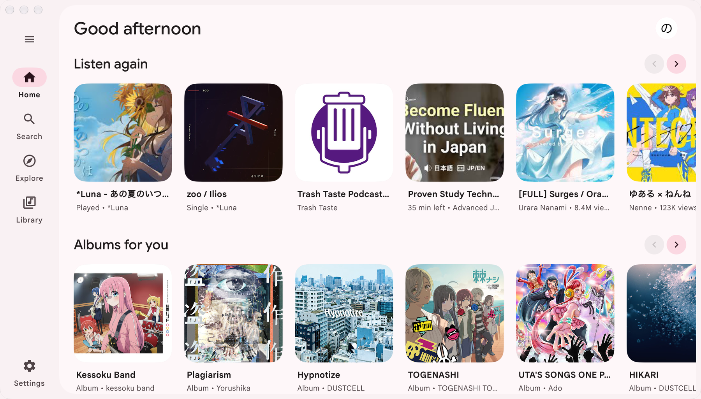
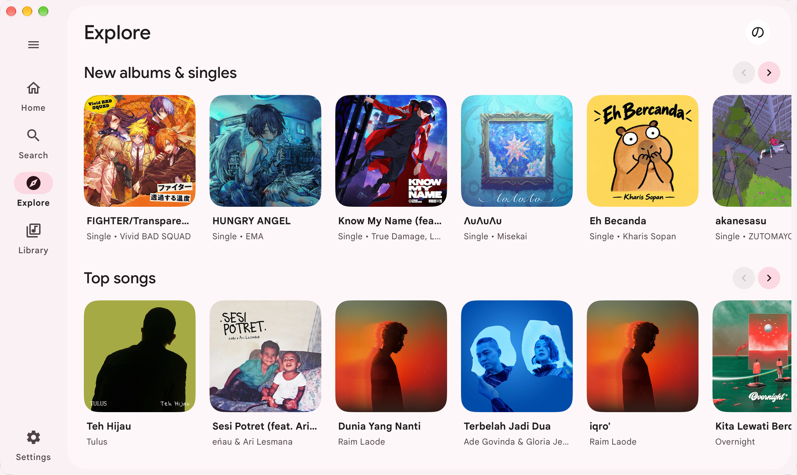
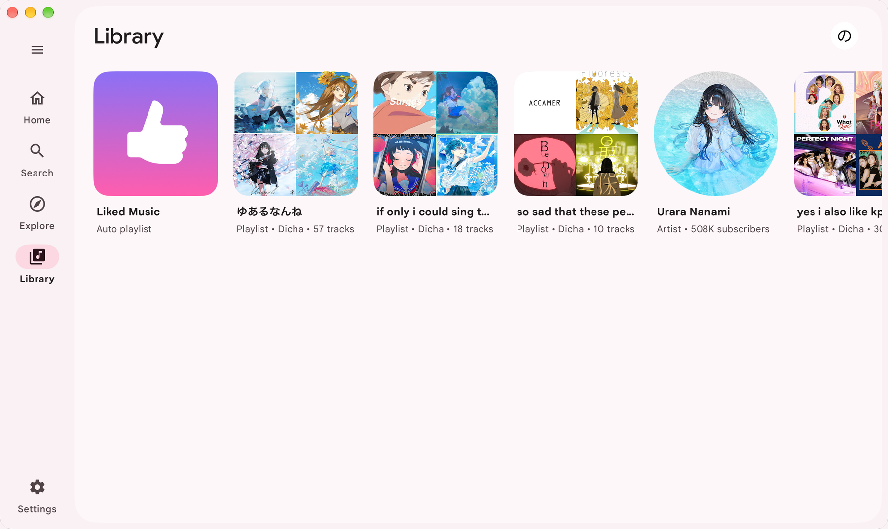
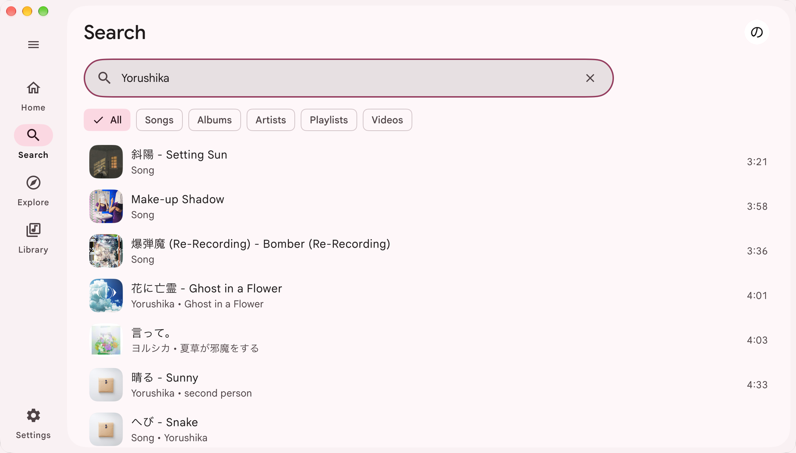
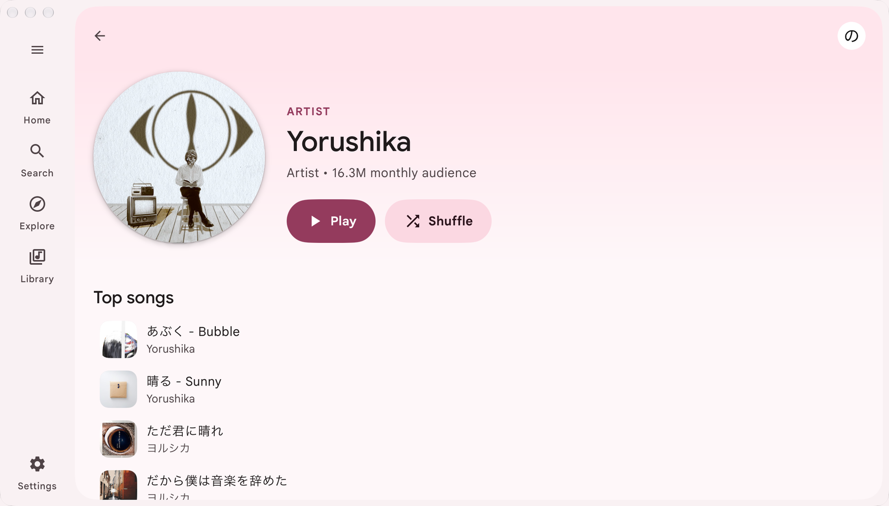
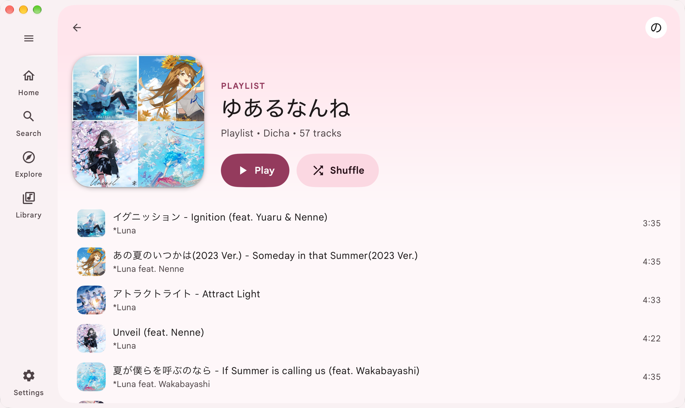

# Meiro

A native desktop player for YouTube Music. Meiro draws its own interface in a
native window instead of using a Chromium-based web front end.

## Features

- **Browse.** View your Home feed and Explore, then open artist, album, and
  playlist pages. Sign in to view your Library.
- **Search.** Search across all result types or filter by songs, albums,
  artists, playlists, and videos. Meiro keeps your eight most recent searches.
- **Play.** Play tracks from feeds, search results, and playlists. Seek, adjust
  the volume, move to the previous or next track, shuffle, and repeat the
  current track or queue.
  After you select a track, the compact player stays available while you
  browse. Open the full player to view the queue, lyrics, and related tracks.
- **Auto-play.** Auto-play is on by default. It adds YouTube Music
  recommendations after the current queue ends. Toggle it in the queue.
- **Choose an appearance.** Follow the system theme, or choose light or dark.
  Pick a Material 3 palette, adjust its hue, or use the current track's artwork
  to set the app colours.
- **Cache recent audio.** Meiro caches ten recently played tracks by default.
  Choose a different limit and folder. Cached MP3 files go in a private cache
  folder. Set the limit to `0` to turn off the cache.
- **Use keyboard shortcuts.** Press Space to play or pause. Use Command on
  macOS or Ctrl on Linux with Left or Right to change tracks. Use K or F to
  open Search, and Comma to open Settings.
- **Use system media controls.** Control playback from macOS Now Playing or a
  Linux MPRIS client. Meiro publishes track details, cover art, and playback
  state. It accepts play, pause, stop, previous, next, seek, volume, shuffle,
  and repeat commands.

Browse and play public music without signing in. Meiro imports a browser
session to show your personalized Home feed and Library.

## Screenshots

These screenshots show real pages from a signed-in YouTube Music session.
Explore is shown in a compact window, with Trending below the visible area.

<p align="center">
  
</p>

<p align="center">
  
</p>

<table>
  <tr>
    <th>Library</th>
    <th>Search</th>
  </tr>
  <tr>
    <td></td>
    <td></td>
  </tr>
  <tr>
    <td>Saved playlists and artists from the signed-in account.</td>
    <td>Search results with filters for songs, albums, artists, playlists, and videos.</td>
  </tr>
</table>

<table>
  <tr>
    <th>Artist</th>
    <th>Playlist</th>
  </tr>
  <tr>
    <td></td>
    <td></td>
  </tr>
  <tr>
    <td>An artist page with its top songs.</td>
    <td>A playlist page with playback controls and tracks.</td>
  </tr>
</table>

## Install

Download the latest build for your system from the
[releases page](https://github.com/elianiva/meiro/releases/latest).

**macOS**: open the disk image and drag Meiro to Applications. The app is not
notarized by Apple yet, so the first time, right-click it and choose **Open**
(or allow it under System Settings > Privacy & Security).

**Linux**: install the `.deb` on Debian or Ubuntu, or the `.rpm` on Fedora or a
compatible RPM-based distribution. You can also make the `.AppImage` executable
and run it, or unpack the `.tar.gz` and run its `install.sh`. All Linux builds
need GTK 3 and WebKitGTK 4.1.

## Signing in

To see your personalized Home feed and Library, sign in at
[music.youtube.com](https://music.youtube.com) in a supported browser. In Meiro,
choose **Sign in** and select that browser. Meiro imports the browser's YouTube
Music session. It does not use an app-scoped OAuth token, so it has the same
account access as the browser session.

Meiro can import from Chrome, Safari, Firefox, Brave, or Edge. It can also
import from Helium when it finds a browser profile.

Meiro stores the session in the system credential store where available. If
the system has no credential store, Meiro uses a file that only your user can
read. A locked or failing credential store does not trigger this fallback.
Choose **Sign out** to remove Meiro's saved session.

Public browsing and playback do not need an account.

## Build it yourself

You need the Go version listed in [`go.mod`](go.mod) and
[just](https://just.systems/).

```sh
just dev     # run with live reload; ffmpeg and yt-dlp must be on PATH
just run     # build the production app with bundled tools, then open it
```

Run `just` to list the other commands. The release workflow builds DMGs for
macOS Apple Silicon and Intel, plus Linux `amd64` and `arm64` `.deb`, `.rpm`,
`.AppImage`, and `.tar.gz` downloads. See
[`.github/workflows/release.yml`](.github/workflows/release.yml).

## Credits

- [MyGo](https://mygo.egoist.dev/) by [EGOIST](https://github.com/egoist),
  the framework that draws Meiro's native window and interface.
- [ffmpeg](https://github.com/jellyfin/jellyfin-ffmpeg) decodes the audio,
  [yt-dlp](https://github.com/yt-dlp/yt-dlp) finds the streams, and
  [QuickJS](https://github.com/quickjs-ng/quickjs) runs the JavaScript yt-dlp
  needs to solve YouTube's challenges. All three ship inside the app; see
  [`resources/THIRD-PARTY-NOTICES.md`](resources/THIRD-PARTY-NOTICES.md).
- [Google Sans](https://github.com/googlefonts/googlesans) sets the text,
  under the SIL Open Font License (`fonts/OFL.txt`).

## License

Meiro is free software, under the [GNU General Public License v3.0](LICENSE).

Meiro is an independent project and is not affiliated with or endorsed by
YouTube or Google.
