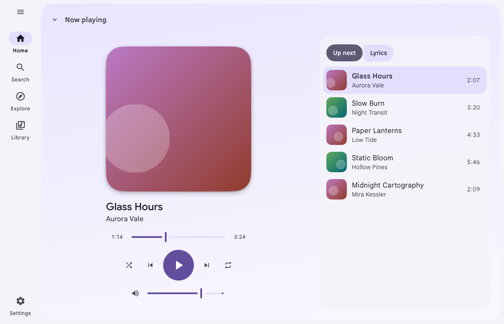
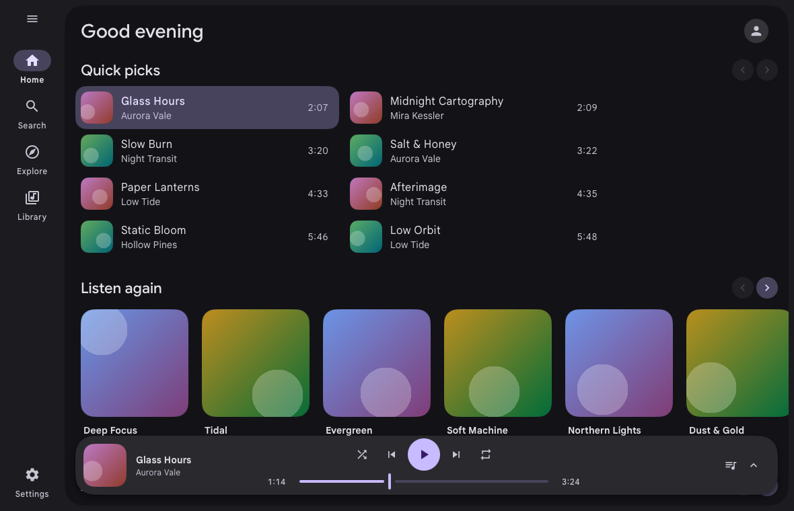
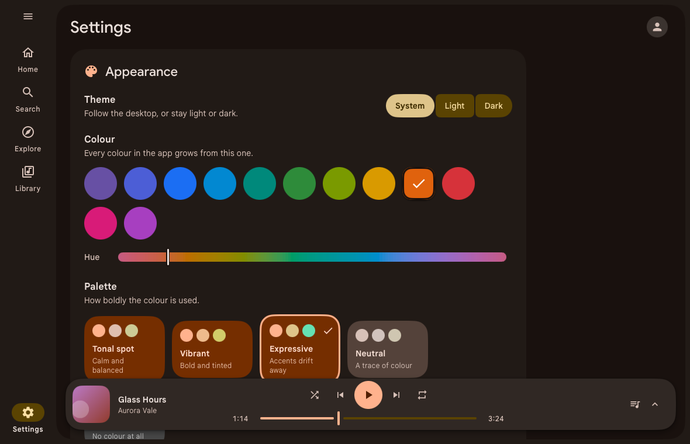

# Meiro

A small, fast desktop client for YouTube Music.

Meiro draws its own native window, so it opens at once, and it needs no
browser engine behind it. Download it and play: everything it needs comes in
the box.

<p align="center">
  
</p>

## What you get

- Your YouTube Music home, explore feeds, search, albums, playlists and
  artists, and your own library when you sign in.
- A player that floats over the page and opens into a full-screen view with
  the queue and the lyrics.
- A look that follows [Material 3 Expressive](https://m3.material.io/blog/building-with-m3-expressive),
  in light or dark, in any colour you choose, or in the colours of the cover
  that is playing.

<p align="center">
  
  
  
</p>

## Install

Download the latest build for your system from the
[releases page](https://github.com/elianiva/meiro/releases/latest).

**macOS**: open the disk image and drag Meiro to Applications. The app is not
notarized by Apple yet, so the first time, right-click it and choose **Open**
(or allow it under System Settings > Privacy & Security).

**Linux**: install the `.deb`, or unpack the `.tar.gz` and run its
`install.sh`. You need GTK 3.

## Signing in

Public music works without an account. To see your own home page and
library, sign in at music.youtube.com in your browser, then choose **Sign in**
in Meiro and pick that browser. Meiro imports a reusable browser session, not
an app-scoped OAuth token; it has the same account access as that browser
session. Meiro stores it in the system credential store where available. If
the system has no credential store, it uses a file readable only by your user.
A locked or failing credential store does not cause that fallback. **Sign out**
removes Meiro's saved copy.

## Build it yourself

You need [Go](https://go.dev/dl/) and [just](https://just.systems/).

```sh
just dev     # run with live reload, using ffmpeg and yt-dlp from your PATH
just run     # build the production app, with its tools inside, and open it
```

`just` lists the rest. Releases are built by pushing a version tag; see
`.github/workflows/release.yml`.

## Credits

- [MyGo](https://mygo.egoist.dev/) by [EGOIST](https://github.com/egoist),
  the framework that draws Meiro's native window, and the reason it needs no
  web frontend.
- [ffmpeg](https://github.com/jellyfin/jellyfin-ffmpeg) decodes the audio,
  and [yt-dlp](https://github.com/yt-dlp/yt-dlp) finds the streams. Both
  ship inside the app; see
  [`resources/THIRD-PARTY-NOTICES.md`](resources/THIRD-PARTY-NOTICES.md).
- [Google Sans](https://github.com/googlefonts/googlesans) sets the text,
  under the SIL Open Font License (`fonts/OFL.txt`).

## License

Meiro is free software, under the [GNU General Public License v3.0](LICENSE).

Meiro is an independent project and is not affiliated with or endorsed by
YouTube or Google.
